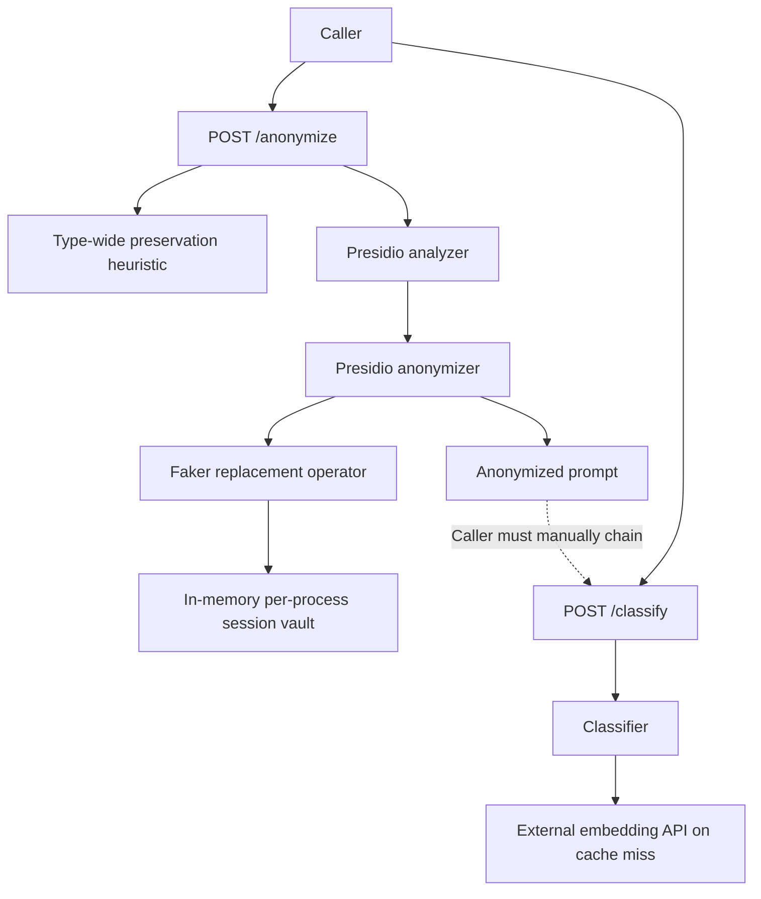

# Anonymization Code and Architecture Review

## Scope

Static review of the current anonymization feature, including:

- `app/presidio_service/`
- `/anonymize` API schemas and endpoint
- Presidio/Faker configuration and dependencies
- anonymization unit, integration, session, and E2E tests
- documentation and container deployment
- interaction with the prompt-classification path

The working tree contains uncommitted anonymization changes and new tests. They
were reviewed in place and were not otherwise modified by this review.

## Executive summary

The implementation has strong foundations for an MVP: original values are not
returned, replacement mappings are consistent within one process, concurrent
first sightings are now atomic, replacements avoid direct collisions, request
size is bounded, and the tests cover many difficult cases.

It is not yet a reliable privacy boundary for real Claude Code prompts.

The most important issue is architectural: anonymization is an optional sibling
endpoint. `/classify` still accepts the raw prompt directly, and embedding-based
classification can send that raw prompt to an external API. Nothing ensures that
callers anonymize before classification or before forwarding to an LLM.

There are also known leaks that the test suite deliberately treats as passing
behavior: some SSNs, international phone numbers, and names in compact JSON remain
unchanged. Date auto-preservation can expose unrelated dates. Therefore
`206 passed` means the implementation matches its current behavior; it does not
mean anonymization is complete or meets a 99.9% privacy target.

## Current architecture



The dotted edge is the core problem: privacy depends on every caller remembering
and correctly implementing the sequence.

## Code review findings

### [P0] Known PII leaks are accepted as successful tests

The suite explicitly asserts that sensitive values remain in output:

- `tests/test_anonymize_behavior.py:284-289` accepts an undetected SSN.
- `tests/test_anonymize_real_engine_adversarial.py:68-77` accepts an undetected
  UK phone number.
- `tests/test_anonymize_real_engine_adversarial.py:103-112` accepts a person name
  in compact JSON.

These tests are useful documentation, but they convert privacy regressions into
green CI. The terminal result is unambiguous for developers but misleading for a
security gate.

**Recommendation:** keep characterization tests, but add a separate mandatory
privacy-gate suite whose expected behavior is no leakage. Known failures should
block promotion or be listed in an explicit, reviewed exception manifest with
owners and expiry dates.

### [P0] Type-wide date preservation leaks unrelated sensitive dates

`app/presidio_service/service.py:104-119` converts preservation into a map from
entity type to Presidio's `keep` operator. When `DATE_TIME` is required, every
detected date is preserved.

The test at `tests/test_anonymize_real_engine_adversarial.py:216-228` confirms
that a private login date remains visible merely because the same prompt asks a
retirement question using a different date.

This is a direct privacy leak caused by the semantic-preservation mechanism.

**Recommendation:** preserve individual spans, not entire entity types. Semantic
analysis should identify the exact date or value required for the task. If the
system cannot determine which span is required, return an uncertainty result or
use a transformation that preserves the necessary relation without exposing the
original value.

### [P0] Arbitrary caller-directed preservation can bypass anonymization

`app/schemas.py:31` accepts any list of strings in `preserve_entity_types`, and
`app/presidio_service/service.py:104-119` installs a `keep` operator for each one.
A caller can request preservation of `PERSON`, `EMAIL_ADDRESS`, `US_SSN`, or every
known type.

If `/anonymize` is a privacy enforcement boundary, the untrusted caller must not
be able to disable it. Even for trusted callers, a typo or overly broad request
can silently expose data.

**Recommendation:** remove this option from the public request, restrict it to a
small policy allowlist, or require a separately authorized trusted-policy role.
Prefer span-level semantic requirements over type-level bypasses.

### [P1] The session vault retains original PII indefinitely

`SessionVault._sessions` at `app/presidio_service/service.py:27-37` has no TTL,
capacity limit, deletion API, session completion signal, or eviction strategy.
Every distinct caller-controlled `session_id` and original value remains in
process memory until restart.

Consequences:

- unbounded memory growth and denial of service;
- retention of original PII longer than necessary;
- no support for deletion or privacy retention requirements;
- high-cardinality session identifiers can intentionally exhaust memory.

`session_id` itself has no maximum length in `app/schemas.py:28`.

**Recommendation:** define a retention policy. Add bounded session and entry
counts, TTL eviction, explicit session deletion, maximum identifier length, and
metrics. Store only what is necessary for the conversation lifetime.

### [P1] Session isolation is not tied to caller identity

The vault is indexed only by caller-provided `session_id`
(`app/presidio_service/service.py:31-37`). There is no authentication or tenant
namespace in the key.

Two callers using the same session ID share a mapping. A caller who can predict or
reuse another session ID can poison mappings and potentially use pseudonym output
as a membership/linkage oracle.

**Recommendation:** authenticate callers and key vault entries by
`(tenant_id, principal_id, session_id)`. Use server-issued opaque session handles
or validate sufficiently random identifiers.

### [P1] Detection coverage does not match Claude Code data

The analyzer uses default English Presidio recognizers plus spaCy
(`app/presidio_service/service.py:62-75`). Claude Code prompts commonly contain
sensitive values outside standard PII:

- API keys and bearer tokens;
- private keys and certificates;
- JWTs and cookies;
- database and cloud connection strings;
- GitHub, AWS, Azure, GCP, and package-registry credentials;
- internal hostnames, repository URLs, file paths, usernames, and account IDs;
- source-code literals and secrets embedded in JSON/YAML/logs.

The current known leaks show that even conventional PII coverage is incomplete.

**Recommendation:** define a project-specific sensitive-data taxonomy and add
custom recognizers with deterministic tests. Treat secrets and internal
identifiers as first-class entities, not just people and contact details.

### [P1] Semantic preservation is a lexical heuristic with privacy-dangerous false positives

`app/presidio_service/semantics.py:24-55` scans the entire prompt for keyword
patterns. It does not understand quotation, negation, code blocks, field
relationships, or which value participates in a calculation.

Passing `test_gap_*` cases show that:

- quoted or negated intent still preserves dates;
- implicit arithmetic that needs a real date is missed;
- a trigger anywhere in the prompt affects every date.

**Recommendation:** replace global type inference with a structured decision:

1. detect candidate sensitive spans;
2. identify task dependencies between instructions and spans;
3. preserve or transform only required properties;
4. fail closed when the dependency is uncertain.

### [P1] Realistic replacements can change operational meaning

`app/presidio_service/operators.py:29-44` generates realistic names, URLs, IP
addresses, cards, locations, and dates. This preserves surface fluency but not
necessarily semantics:

- a public IP may replace a private IP;
- a URL may point to a real-looking external host;
- a date replacement changes age, ordering, duration, and expiry;
- an email replacement changes domain/organization relationships;
- a person name does not remain linked to that person's email;
- phone, account, or card formatting may differ from the original.

For an agent that can run commands or access URLs, realistic replacements can be
acted upon. Faker output should not be assumed harmless.

**Recommendation:** use type-specific safe reserved values and preserve required
structural properties. Examples include `.invalid` domains, documentation IP
ranges, non-routable identifiers, and relationship-aware synthetic entities.
Never generate values that could target real systems.

### [P1] Span-boundary errors can corrupt structured prompts

Current tests document cases where spaCy absorbs command words or Markdown field
labels into a `PERSON` span. This breaks both session coherence and prompt
structure.

The operator cannot fix this because it receives the already-selected span
(`app/presidio_service/operators.py:71-75`).

**Recommendation:** add pre/post-processing for structured formats, custom
recognizers with stronger boundaries, and structural validation. For JSON, YAML,
and code, parse the format and anonymize values rather than applying free-text NER
to the serialized document.

### [P2] A global replacement lock limits concurrency

`app/presidio_service/operators.py:25` defines one process-wide `RLock`, and
`operate()` holds it while calling Faker and checking all existing values
(`app/presidio_service/operators.py:77-87`).

This fixes correctness, but serializes replacement generation for every session
and entity type. `_unique_fake()` also rebuilds a set of all prior fake values on
each insertion, making large sessions progressively more expensive.

**Recommendation:** put synchronization and a reverse set inside each session or
entity mapping. Keep a `fake -> original/key` index so uniqueness checks are O(1).

### [P2] API validation is too permissive

`AnonymizeRequest` bounds only prompt length. It does not constrain:

- `session_id` length or format;
- number of preservation entries;
- allowed entity type names;
- duplicate values;
- supported language;
- policy/version selection.

Response fields also use unrestricted strings for entity type and action
(`app/schemas.py:38-42`).

**Recommendation:** add strict enums/Literals, bounded collections, identifier
limits, a schema version, and an explicit supported language.

### [P2] Exception logging may still expose sensitive content

The endpoint does not log prompt text directly, which is good. However,
`logger.exception()` at `app/main.py:115-123` records exception messages and
tracebacks from Presidio, spaCy, Faker, and custom code. A dependency exception
could include offending text.

The API tests prove that response bodies are sanitized, not that logs are free of
PII.

**Recommendation:** log a request ID and stable error category. Audit dependency
exceptions before recording messages, and add tests with a capture handler that
assert sensitive prompt fragments are absent.

### [P2] Configuration and dependencies are not reproducible enough

The spaCy model is pinned, but Presidio, Faker, FastAPI, spaCy, and other packages
are not version-pinned in `requirements.txt`. Detection behavior is model- and
library-version dependent, so upgrades can silently change both leakage and
over-redaction.

**Recommendation:** lock the full dependency graph and record the analyzer,
recognizer, NLP model, threshold, and anonymization-policy versions in responses
or telemetry.

## Architecture review findings

### [P0] Anonymization is optional and can be bypassed

`/anonymize` and `/classify` are independent endpoints
(`app/main.py:92-125`). A caller may send raw content directly to `/classify`.
With the active embedding model, that path can transmit the raw prompt to an
external embedding provider.

The README says anonymization happens before forwarding to an LLM, but the
service does not enforce or implement that flow.

**Recommendation:** expose one orchestration endpoint or place anonymization in
mandatory middleware/gateway logic:

```text
raw prompt -> anonymize -> validate no-leak policy -> classify -> route/forward
```

Do not expose a raw downstream path to ordinary callers.

### [P0] Process-local state breaks the advertised session guarantee

Session mappings live in one Python process. The same `session_id` routed to:

- another uvicorn worker;
- another container replica;
- the same instance after restart;

receives a different mapping. The documented same-session coherence guarantee is
therefore true only for a single process lifetime.

**Recommendation:** choose and document one of these architectures:

1. single-process service with no horizontal scaling and explicit ephemeral
   sessions;
2. sticky routing plus bounded local vaults;
3. encrypted shared session vault;
4. deterministic keyed pseudonymization that does not require mutable state.

For a scalable internal service, keyed deterministic pseudonymization or an
encrypted shared vault is preferable.

### [P1] There is no round-trip response design

The service creates realistic replacements but stores only
`original -> fake` mappings. It has no `fake -> original` resolution API and no
component that rehydrates LLM responses.

If an LLM responds with a fake person, URL, path, or identifier, the caller
cannot safely apply the answer to the original context. This is especially
important for Claude Code, whose output may contain edits and commands.

**Recommendation:** define whether anonymization is:

- irreversible redaction, in which case use explicit safe tokens; or
- reversible pseudonymization, in which case maintain a secured reverse map and
  de-anonymize only validated response spans.

Realistic pseudonyms without a round-trip contract occupy an unsafe middle
ground.

### [P1] Anonymizer readiness is absent from health reporting

The Presidio engines load on the first request
(`app/main.py:47-49`, `app/presidio_service/service.py:54-80`). `/health` reports
only classifier readiness and can be healthy while the NLP model is missing or
unloadable.

The first real request also pays model initialization latency.

**Recommendation:** warm the anonymizer during startup or expose separate
liveness/readiness details. A deployment that requires anonymization must not
become ready until the exact analyzer model and recognizers are loaded.

### [P1] The service combines two different scaling profiles

Prompt classification and spaCy NER share one process and deployment:

- spaCy has significant memory and cold-start cost;
- the classifier may call an external embeddings API;
- the session vault adds mutable state;
- training remains available in the same API process.

This makes worker count, memory sizing, deployment, and failure isolation harder.

**Recommendation:** either enforce a single privacy-routing pipeline in one
carefully sized service or split the anonymizer into a dedicated internal data
plane. Training should remain outside both serving paths.

### [P1] No authentication, rate limiting, or tenant boundary protects PII intake

The endpoint accepts raw PII, creates retained session state, and performs
expensive NLP work without authentication or request quotas. Being “internal” is
not sufficient when the service handles sensitive prompts.

**Recommendation:** use workload authentication, tenant-aware authorization,
TLS, request and session quotas, concurrency limits, and audit events that do not
contain prompt text.

### [P2] Deployment packaging is large and has no anonymizer-specific controls

The Docker image installs the large spaCy model together with all training and
classification dependencies. It runs with the base image's default user, has no
container healthcheck, resource limits, read-only filesystem policy, or model
warmup.

README examples use port `8081`, while Docker exposes `8080`.

**Recommendation:** build a serving-only image, run as a non-root user, add
health/readiness checks and resource limits, and make documented ports
consistent.

## Test architecture assessment

### Strengths

- Good separation between operator, semantic, API-contract, real-engine, session,
  and live-server tests.
- Strong coverage of equality, distinctness, concurrency, Unicode normalization,
  response filtering, size limits, structured prompts, and offset integrity.
- Long-session tests exercise relationships across many turns.
- Tests avoid returning or asserting original-to-fake mappings through the API.

### Gaps

- Characterization tests for leaks pass normal CI.
- Most real-engine modules skip when dependencies or the NLP model are missing;
  a misconfigured CI environment may report success without exercising privacy.
- No multi-process, restart, replica, TTL, capacity, eviction, or tenant-isolation
  tests.
- No non-English tests despite unrestricted input.
- No custom-secret recognizer tests.
- No log-capture privacy tests.
- No load, latency, or memory-growth tests.
- No deployment test confirms anonymizer readiness or exact model version.
- Random Faker output can introduce nondeterministic edge cases.

## Recommended target architecture

```mermaid
flowchart LR
    C["Authenticated caller"] --> G["Single privacy routing API"]
    G --> V["Validate size, language, tenant, session"]
    V --> D["Structured + custom sensitive-data detection"]
    D --> P["Span-level semantic policy"]
    P --> T["Safe deterministic pseudonymization"]
    T --> Q["Leak/structure validation"]
    Q --> CL["Classifier and model routing"]
    CL --> LLM["Approved downstream model"]
    LLM --> R["Optional validated rehydration"]
    R --> C

    K["KMS-backed key or encrypted bounded vault"] --> T
    O["Privacy-safe metrics and audit events"] <-- G
    O <-- Q
```

### Required properties

- No raw bypass path.
- Authenticated, tenant-scoped sessions.
- Bounded and expiring state, or deterministic keyed mapping.
- Custom recognizers for code and credentials.
- Span-level preservation instead of entity-type preservation.
- Reserved, non-routable replacements.
- Structural parsing for JSON/YAML/code where possible.
- Explicit behavior for unsupported language and low-confidence detection.
- Anonymizer readiness included in deployment health.
- Privacy-gate tests that fail on known leaks.

## Recommended order of work

1. Make anonymization mandatory before any embedding or LLM transmission.
2. Remove or strictly authorize type-wide preservation.
3. Replace type-wide date keeping with span-level semantic policy.
4. Add custom recognizers for secrets and the known SSN/phone/JSON gaps.
5. Add session TTL, limits, deletion, tenant namespacing, and authentication.
6. Decide between irreversible redaction and reversible pseudonymization.
7. Use safe reserved replacements and preserve structural relationships.
8. Add anonymizer readiness, locked dependencies, and deployment controls.
9. Separate known-gap characterization tests from the release privacy gate.

## Final assessment

The feature is a serious and well-tested prototype, particularly at the
pseudonym-mapping layer. The remaining risk is not a small accuracy adjustment.
The current API and state architecture allow bypass, indefinite PII retention,
cross-process inconsistency, broad preservation leaks, and known detector misses.

Before this can be trusted as the privacy boundary for Claude Code traffic, the
system must enforce anonymization in the only allowed request path and treat
known leaks as release blockers rather than successful behavior.
